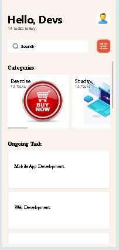

# View: Used for structuring the layout of different screens.
# Text: For displaying textual content.
# ScrollView: Enables scrolling functionality for long lists or content.
# TextInput: Allows users to input text, such as task descriptions or titles.
# Stylesheet: Utilized for styling the components and providing a consistent visual experience.
# Button: Used for triggering actions, such as adding new tasks or marking tasks as completed.
# FlatList or SectionList: Implemented for rendering lists of tasks under different categories.
# Image: Utilized for displaying icons and images within the application.

